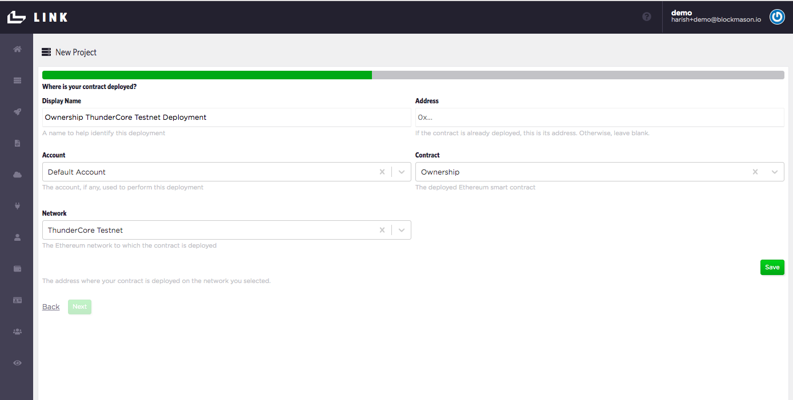
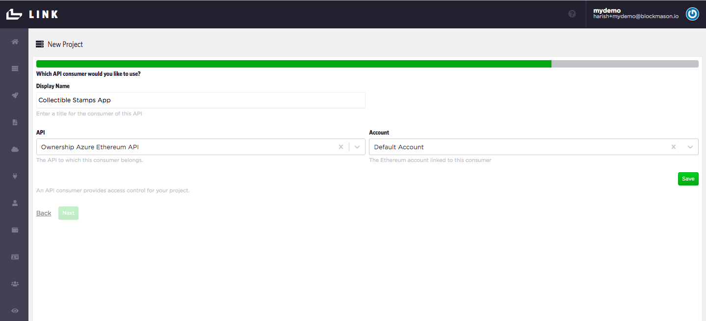
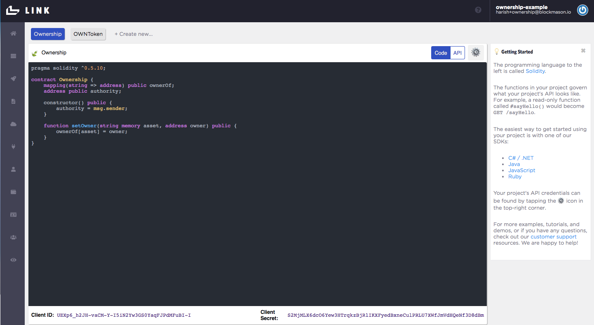

## Using Microsoft Azure Private Blockchain with Blockmason Link
Microsoft's Azure Blockchain Service makes it easy to build, govern and expand consortium blockchain networks at scale. Here, we show how you can quickly create your own private blockchain on Azure, and use the simplicity of Blockmason Link to deploy and interact with smart contracts on your Azure blockchain.

### Setup
Azure offers a a free trial of their cloud service, where you are provided with a $260 credit to 'explore any Azure service for 30 days'. Additionally, there are a handful of services offered which are 'always free' (Blockchain Service is *not* one of those at the moment). See https://azure.microsoft.com/en-ca/free/blockchain/ for details on how to start. 

> Follow this *Quickstart* guide to create an Azure Blockchain Service (preview) blockchain member: https://docs.microsoft.com/en-us/azure/blockchain/service/create-member

A few things to note with this blockchain setup:
* This will be a private blockchain network using the **Quorum** protocol (https://www.goquorum.com/) but still Ethereum-compatible. 

* This is a private network will have no gas fees for transactions.

* Instead of the `Standard - 2 vCores` setup, you can simply use the `Basic - 1 vCore` option instead which has 1 validator node and 1 transaction node. Note - the price per month is what will come off your $260 credit if you are using the `Free Trial` subscription.

* Deployment of the Azure blockchain member **can take up to 30mins.**
 

### Get the RPC Endpoint Address
Once you have successfully deployed your Azure blockchain member, you will need the RPC endpoint address for Blockmason Link to connect to your network. 

> 1. Ensure you are signed into the Azure portal.

> 2. Navigate to your Azure Blockchain Service resource. Select *Transaction nodes* under *Blockchain* and then click on the default transaction node link.

> 3. Select *Setting > Connection strings*

> 4. Copy the endpoint address from *HTTPS (Access key 1)*. You will need this address to use when setting up a network connector in Blockmason Link.

### API project setup in Link
> 1. In Link, either press the `+ Create new` button above the code editor or open up the setting dropdown menu and select *`New Project`* - both which starts the new project wizard.

> 2. Under *Which contract would you like to use?*, select `Ownership` if the contract already exists, or select *`Create new`* and then copy and paste the `Ownership.sol` code into the *Source Code* field. Set the *Display Name* as `Ownership`. Press *`Save`* and *`Next`*.

.

> 3. Under *Which Ethereum account would you like to use?*, use the *`Default Account`*.

> 4. Under *Which network would you like to use?*, select *`Create new`* and call it `Azure Private Ethereum`. Keep the *Block Confirmations Needed* at 0. Press *`Save`* and *`Next`*.

> 5. Under *Which connector would you like to use?*, select *`Create new`*. Call this connector `Azure Ethereum Connector` and use the HTTPS Connection String that you copied earlier from Azure (e.g. `https://myazureblockchain.blockchain.azure.com:3200/...`) Ensure the *Network* selected is *`Azure Private Ethereum`*. Press *`Save`* and *`Next`*.

> 6. Now we just need to label our Deployment. Under *Where is your contract deployed?*, select *`Create new`*. Call this deployment `Ownership Azure Ethereum Deployment`. Since we do not have **an existing contract deployment**, leave the *Address* field blank. Ensure the *Account* is the `Default Account`, the *Contract* is the `Ownership` contract and the *Network* `Azure Private Ethereum`. Press *`Save`* and *`Next`*.

> 7. Now we're ready to deploy our contract to the ThunderCore Testnet. Press `Deploy` and you should get a deployment in progress indicator icon. This might take up to a minute to complete. If deployed correctly, you'll proceed to the next step to set up your API.

> 8. Now we label our Ownership contract API. Under *Name*, call it *`ownership-azure-ethereum`* Also add in a human-readable display name. Ensure you are using the correct *Contract Deployment*. Press *`Save`* and *`Next`*.

> 9. Now we label our Ownership API **Consumer**. This would normally be the name of the app or service calling the API. For example, let's call the consumer `Collectible Stamps App`. Ensure you are using the correct *API* and *Account*. Press *`Save`* and *`Next`*.

> 10. Lastly, your consumer needs to authenticate with the Ownership API. An OAuth2.0 Client Secret is automatically generated. Ensure you are using the correct Principal/Consumer. Press *`Save`*, *`Next`* and then *`Finish`*.

Once you hit *`Finish`*, you should end up back at Home page and see your Ownership code in the IDE, the API tab and a gear icon containing the `client_id` and `client_secret` at the bottom of the page which you will use in your app. 

Now unlike the public blockchains, we do not have a public block explorer where we can verify these transactions. However, Azure Blockchain Services provides us with some nice block graphs and metrics in our resource's *Overview* page:

> Have a look at the **Transactions** and **Handled Requests** graphs to see if transactions are being recorded as expected. 

**Azure Blockchain Services has a wealth of tools available so feel free to dig into their Monitoring and logging tools to get a better view on your blockchain!**

> You can also explore your private blockchain using conventional API tools such as Postman or `curl` statments from your Terminal and use the JSON-RPC methods highlighted here: https://github.com/ethereum/wiki/wiki/JSON-RPC#json-rpc-methods

### Test Ownership API endpoints
A simple JavaScript file using the Link JavaScript SDK in a Node environment can be found here:

https://github.com/blockmason/link-onboarding/blob/master/ownership-link-sdk-demo.js

> Simply update the `Client ID` and `Client Secret` for authentication.

 > Then run the `ownership-link-sdk-demo.js` script using Node from a Terminal for example. You should see an output in Terminal similar to the following:

 

 > Verify your transactions using the Azure Blockchain Service tools. 

**You're all set to deploy and interact with smart contracts deployed to your private Azure Ethereum blockchain!**
