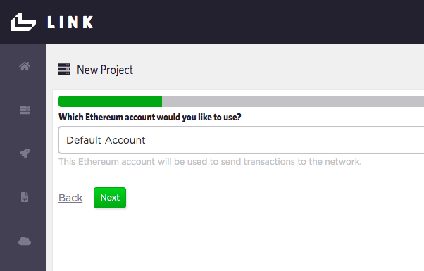

## Using Ethereum with Link
In this onboarding example, we will deploy a smart contract on the Ethereum Ropsten Testnet. 

### Setup

> First, setup an account on Infura, which provides easy-to-use APIs to interact with the Ethereum network without running your own Ethereum node. Register for an API key at https://infura.io/register and then create a project. You will then be able to access URLs containing your API key for the Ethereum Mainnet and all Testnets such as Ropsten which we will be using.

> Now seed your Link account wallet with test ETH from https://faucet.ropsten.be/ (1 ETH will be dripped to your wallet), which will be used to pay for transactions on the Ropsten testnet. You can find your Link account wallet address from the Ethereum Account menu as shown:

   

**Note: This Ropsten Faucet tracks the IP of the source making the request. On a common WiFi network, multiple requests from the same external IP will trigger the IP to be grey-listed for 24 hours. If so, connect your laptop to a different WiFi network or temporarily connect to a phone's WiFi hotspot when making the request**

> > Confirm you have received the ETH tokens by searching your Link account wallet address with the Ropsten testnet block explorer: https://ropsten.etherscan.io . 

### API project setup in Link

> 1. In Link, open up the setting dropdown menu and select *`New Project`* which starts the new project wizard.

> 2. Under *Which contract would you like to use?*, select `Ownership` if the contract already exists, or select *`Create new`* and then copy and paste the `Ownership.sol` code into the *Source Code* field. Set the *Display Name* as `Ownership`. Press *`Save`* and *`Next`*.

> 3. Under *Which Ethereum account would you like to use?*, use the *`Default Account`*. This is the account we seeded earlier with test ETH. 

> 4. Under *Which network would you like to use?*, select *`Create new`* and call it `Ethereum Ropsten Testnet`. Keep the *Block Confirmations Needed* at 0. Press *`Save`* and *`Next`*.

> 5. Under *Which connector would you like to use?*, select *`Create new`*. Call this connector `Infura Ropsten Connector` and use the URL for the Ropsten network from Infura (e.g. https://ropsten.infura.io/v3/182b941b70e6443b8854cc53786a3007). Ensure the *Network* selected is *`Ethereum Ropsten Testnet`*. Press *`Save`* and *`Next`*.

> 6. Now we just need to label our Deployment. Under *Where is your contract deployed?*, select *`Create new`*. Call this deployment `Ownership Ropsten Testnet Deployment`. Since we do not have **an existing contract deployment on Ethereum**, leave the *Address* field blank. Ensure the *Account* is the `Default Account`, the *Contract* is the `Ownership` contract and the *Network* `Ethereum Ropsten Testnet`. Press *`Save`* and *`Next`*.

> 7. Now we're ready to deploy our contract to the Ethereum Ropsten Testnet. Press `Deploy` and you should get a deployment in progress indicator icon. This might take a few seconds to complete. If deployed correctly, you'll proceed to the next step to setup your API.

> 8. Now we label our Ownership contract API. Under *Name*, call it *`ownership-ropsten-testnet`* Also add in a human-readable display name. Ensure you are using the correct *Contract Deployment*. Press *`Save`* and *`Next`*.

> 9. Now we label our Ownership API **Consumer**. This would normally be the name of the app or service calling the API. For example, let's call the consumer `Collectible Stamps App Ropsten`. Ensure you are using the correct *API* and *Account*. Press *`Save`* and *`Next`*.

> 10. Lastly, your consumer needs to authenticate with the Ownership API. A OAuth2.0 Client Secret is automatically generated. Ensure you are using the correct Principal/Consumer. Press *`Save`*, *`Next`* and then *`Finish`*.

Once you hit *`Finish`*, you should end up back at Home page and see your Ownership code in the IDE, the API tab and a gear icon containing the `client_id` and `client_secret` at the bottom of the page which you will use in your app. 

Let's also check that our Ownership contract deployed correctly on the Ethereum Ropsten Testnet. Click on the `Ethereum Contract Deployments` menu item to see a list of contract deployments and their addresses. Copy and paste the address of the `Ownership Ropsten Testnet Deployment` into the Ropsten Testnet explorer https://ropsten.etherscan.io to see the details of your contract deployment.

In the above example, the contract address on Ropsten Testnet is `0x5d81167993cb26e25e60be9deb58aab0fe93eccc`.

And we see our contract deployed on the Ropsten Testnet!

Now you can go ahead and use the API endpoints which are linked to the Ownership smart contract deployed on Ethereum Ropsten!

### Test Ownership API endpoints
A simple JavaScript file using the Link JavaScript SDK in a Node environment can be found here:

https://github.com/blockmason/link-onboarding/blob/master/ownership-link-sdk-demo.js

> Simply update the `Client ID` and `Client Secret` for authentication.

 > Then run the `ownership-link-sdk-demo.js` script using Node from a Terminal for example. You should see an output in Terminal similar to the following:

 

 > Check your Ownership contract using the Ropsten Explorer to confirm the new transactions representing the `setOwner()` and `getOwner()` function calls. 

### Deploying to Ethereum Mainnet

If you want to deploy on the Ethereum Mainnet, just follow the same steps above with the following differences:
> Acquire actual ETH to send to your Link default account wallet

> Use the Infura Mainnet URL