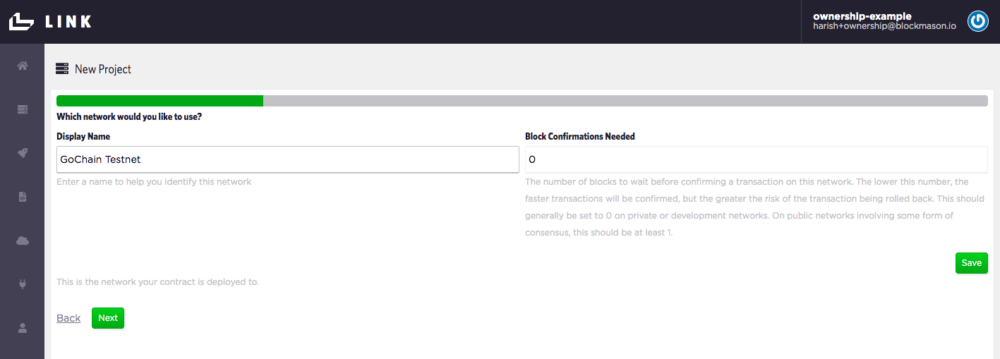
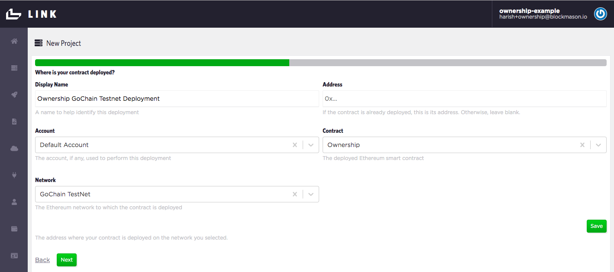
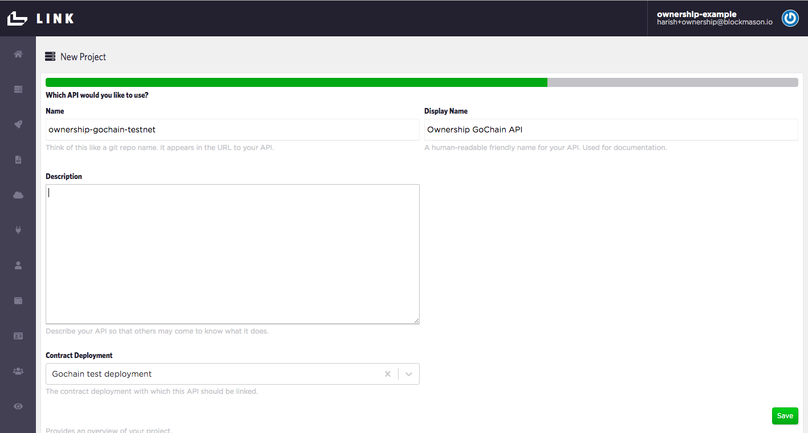

## Using GoChain with Link
In this onboarding example, we will deploy a smart contract on the GoChain Testnet. 

### Setup
> Ask for some free testnet GO in GoChain's [Testnet Telegram](https://t.me/gochain_testnet) to be sent to your Link account

### API project setup in Link
> 1. In Link, open up the setting dropdown menu and select *`New Project`* which starts the new project wizard.

> 2. Under *Which contract would you like to use?*, select `Ownership` if the contract already exists, or select *`Create new`* and then copy and paste the `Ownership.sol` code into the *Source Code* field. Set the *Display Name* as `Ownership`. Press *`Save`* and *`Next`*.

.

> 3. Under *Which Ethereum account would you like to use?*, use the *`Default Account`*. This is the account we seeded with test GO tokens as part of the setup. 

> 4. Under *Which network would you like to use?*, select *`Create new`* and call it `GoChain Testnet`. Keep the *Block Confirmations Needed* at 0. Press *`Save`* and *`Next`*.

> 5. Under *Which connector would you like to use?*, select *`Create new`*. Call this connector `GoChain Testnet Connector` and use the URL `https://testnet-rpc.gochain.io` (see https://github.com/gochain-io/docs#network-rpc-urls for more details). Ensure the *Network* selected is *`GoChain Testnet`*. Press *`Save`* and *`Next`*.

> 6. Now we just need to label our Deployment. Under *Where is your contract deployed?*, select *`Create new`*. Call this deployment `Ownership GoChain Testnet Deployment`. Since we do not have **an existing contract deployment**, leave the *Address* field blank. Ensure the *Account* is the `Default Account`, the *Contract* is the `Ownership` contract and the *Network* `GoChain Testnet`. Press *`Save`* and *`Next`*.

> 7. Now we're ready to deploy our contract to the GoChain Testnet. Press `Deploy` and you should get a deployment in progress indicator icon. This might take a few seconds to complete. If deployed correctly, you'll proceed to the next step to set up your API.

> 8. Now we label our Ownership contract API. Under *Name*, call it *`ownership-gochain-testnet`* Also add in a human-readable display name. Ensure you are using the correct *Contract Deployment*. Press *`Save`* and *`Next`*.

> 9. Now we label our Ownership API **Consumer**. This would normally be the name of the app or service calling the API. For example, let's call the consumer `Collectible Stamps App Ropsten`. Ensure you are using the correct *API* and *Account*. Press *`Save`* and *`Next`*.

> 10. Lastly, your consumer needs to authenticate with the Ownership API. An OAuth2.0 Client Secret is automatically generated. Ensure you are using the correct Principal/Consumer. Press *`Save`*, *`Next`* and then *`Finish`*.

Once you hit *`Finish`*, you should see your Ownership API documentation. Note the `client_id` and `client_secret` under *Authentication* which you will use in your app. 

Let's also check that our Ownership contract deployed correctly on the GoChain Testnet. Click on the `Ethereum Contract Deployments` menu item to see a list of contract deployments and their addresses. Copy and paste the address of the `Ownership GoChain Testnet Deployment` into the GoChain Testnet explorer https://testnet-explorer.gochain.io to see the details of your contract deployment.

In the above example, the contract address on GoChain is `0xa187da3f23129e03904d1ad4a44062970b898e22`.

And we see our contract deployed on GoChain!

Now you can go ahead and use the API endpoints which are linked to the Ownership smart contract deployed on GoChain Testnet!

### Test Ownership API endpoints
A simple JavaScript file using the Link JavaScript SDK in a Node environment can be found here:

https://github.com/blockmason/link-onboarding/blob/master/ownership-link-sdk-demo.js

> Simply update the `Client ID` and `Client Secret` for authentication.

 > Then run the `ownership-link-sdk-demo.js` script using Node from a Terminal for example. You should see an output in Terminal similar to the following:

 

 > Check your Ownership contract using the GoChain Testnet Explorer to confirm the new transactions representing the `setOwner()` and `getOwner()` function calls. 

### Deploying to GoChain Mainnet

If you want to deploy on the GoChain Mainnet, just follow the same steps above with the following differences:
* > Acquire mainnet GO tokens to send to your Link default account wallet
* > Use the use the appropriate [GoChain Network RPC URL](https://github.com/gochain-io/docs#network-rpc-urls) for Mainnet
