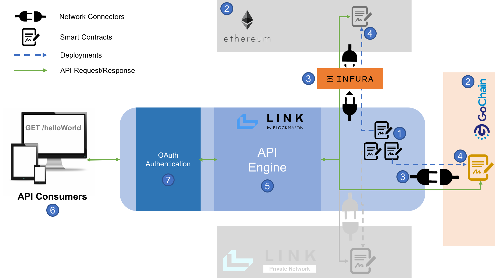

# link-onboarding
https://mason.link

Welcome to the onboarding material for Blockmason Link! We hope Link will be a useful developer tool to help you build your applications. Link is the first managed, decentralized, functions-as-a-service (FaaS) platform, pushing the envelope of interoperability by creating conventional web APIs for developers interacting with networks such as programmable blockchains.

### Signing Up

> Sign up for your Link account at https://mason.link/sign-up with your email address. You will then have to open your email and confirm your address.  

> After clicking on the confirmation link, create your account's passphrase and set your organization namespace. This is your Link organization.


You will then be on the Link Homepage consisting of an IDE with a `Demo` smart contract code. 


### Getting Started
Welcome to the Link Homepage! A few things to note here:

* The smart contract code that you see in the IDE is automatically deployed to the Link private blockchain in **near real-time**. When you make any changes to the code, a new deployment is automatically done.

* You can toggle between the code and the Link generated APIs screens:
. When you modify your code, your APIs will automatically update!

* Click on the Settings gear icon next to the API toggle and at the bottom of the IDE/API window, you will see a `Client ID` and `Client Secret`. These are the credentials you will use to authenticate with Link to access the API endpoint. These credentials stay the same for each project. 

* Currently, only the Solidity smart contract programming language is supported, which is most notably used on the Ethereum blockchain.

> Try it! Here is a simple smart contract code (from `Ownership.sol`) for assigning ownership of an asset. **Delete** the `Demo` contract code and **copy and paste** the following code into the Link IDE and see what API endpoints are generated (note: it may take a few seconds for the change to persist):
```
pragma solidity ^0.5.8;

contract Ownership {
    mapping(string => address) public ownerOf;
    address public authority;
    
    constructor() public {
        authority = msg.sender;
    }
    
    function setOwner(string memory asset, address owner) public {
        ownerOf[asset] = owner;
    }
}
```
Your generated API endpoints should look something like the following.


So using the Link private blockchain, this is **all you need to do** to deploy your contract and generate your APIs. Simply copy/paste your smart contract code and the APIs will appear!

Now, *how do you actually use these API endpoints?*

### Link SDKs
https://blockmason.link/link-sdk/

To make it easy to use Link, we have developed several easy-to-use SDKs in a variety of popular programming languages so you can focus on building your apps using your preferred language. 

With all our SDKs, generally all you need is the `Client ID` and `Client Secret` for authentication.

The following link is to a simple example using the [JavaScript SDK](https://github.com/blockmason/link-sdk.js "Link JavaScript SDK") and our Ownership smart contract code from the previous section. Note this example uses the JavaScript SDK from a Node.js environment which requires the use of `node-fetch`: 

https://github.com/blockmason/link-onboarding/blob/master/ownership-link-sdk-demo.js

First, `POST /setOwner` is called to set the owner of an asset and then `GET /getOwner` is called to retrive the owner address, with the request parameters and response object based on the Link API documentation. If I run the `ownership-link-sdk-demo.js` script using Node from my Terminal, for example, I get:


Note: we do NOT need to use a complex library such as web3.js in our JavaScript file as Link abstracts away the blockchain interactions and complexity 'under-the-hood'. We are simply making an API call as we would with any 3rd party service.

### Using Public blockchains

Currently Link supports the following public blockchains: 
* [Ethereum](https://www.ethereum.org/)
* [GoChain](https://gochain.io/) 
* [RSK](https://www.rsk.co/)

The process for connecting and interacting with an external blockchain using Link is a bit more involved but relatively straightforward using the Link Project Wizard. In general, the process flow looks something like this (the deployment process for the Link private blockchain greyed out):



1. Create your smart contract in Link
2. Label your public blockchain
3. Setup your network connector by identifying the network's public JSON-RPC API endpoint. 
4. Deploy your smart contract onto the public blockchain
5. Label your generated APIs
6. Label your API Consumer (e.g. the name of your app using the APIs)
7. Obtain your OAuth API authentication (automatically generated)

#### Deploying on Ethereum
[Documentation on using Link to deploy to Ethereum public blockchains](https://github.com/blockmason/link-onboarding/blob/master/Ethereum.md)

#### Deploying on GoChain
[Documentation on using Link to deploy to GoChain public blockchains](https://github.com/blockmason/link-onboarding/blob/master/GoChain.md)

#### Deploying on RSK
[Documentation on using Link to deploy to RSK public blockchains](https://github.com/blockmason/link-onboarding/blob/master/RSK.md)