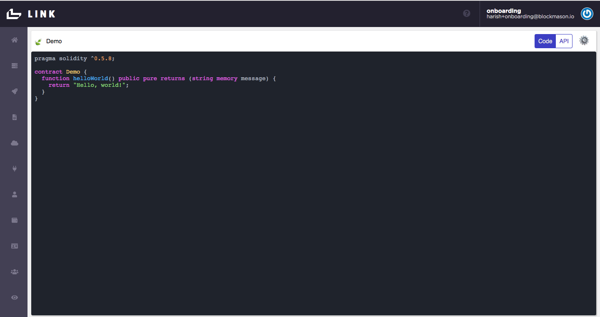
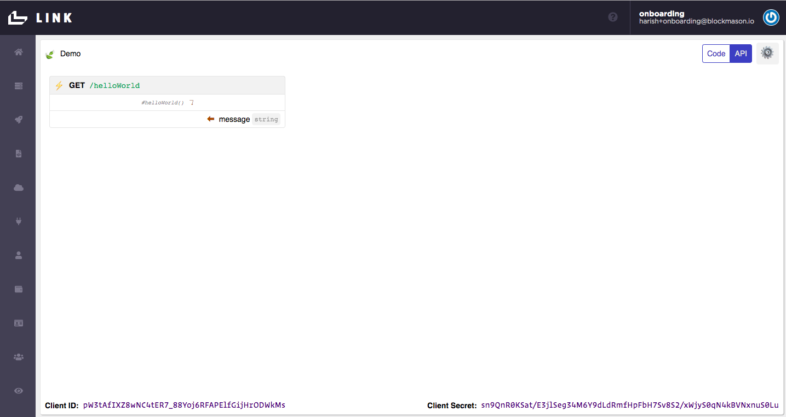
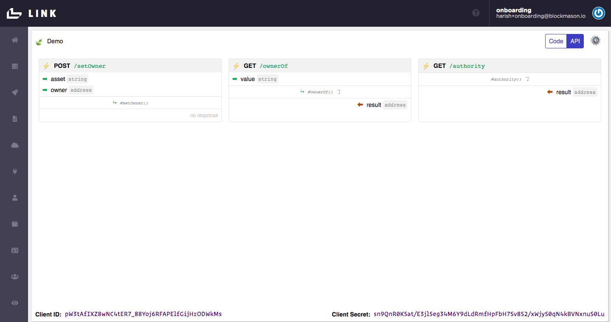

# link-onboarding
Welcome to the onboarding material for Blockmason Link! We hope Link will be a useful developer tool to help you build your applications. Link is the first managed, decentralized, functions-as-a-service (FaaS) platform, pushing the envelope of interoperability by creating conventional web APIs for developers interacting with networks such as programmable blockchains.

### Signing Up

> Sign up for your Link account at https://mason.link/sign-up with your email address. You will then have to open your email and confirm your address.  

> After clicking on the confirmation link, create your account's passphrase and set your organization namespace. This is your Link organization.


You will then be on the Link Homepage consisting of an IDE with a `Demo` smart contract code. 



### Getting Started
Welcome to the Link Homepage! A few things to note here:

* The smart contract code that you see in the IDE is automatically deployed to the Link private blockchain in **near real-time**. When you make any changes to the code, a new deployment is automatically done.

* You can toggle between the code and the Link generated APIs screens:
. When you modify your code, your APIs will automatically update!

* At the bottom of the IDE/API window, you will see a `Client ID` and `Client Secret`. These are the credentials your front-end app will use to authenticate with Link to access the API endpoint.

* Currently, only the Solidity smart contract programming language is supported, which is most notably used on the Ethereum blockchain.

Since smart contracts deployed onto a blockchain are generally immutable (i.e. can NOT be changed), every time you make a change to the smart contract code in the Link IDE, effectively a new smart contract is being deployed which means a new `Client ID` and `Client Secret` will be generated for authentication.

> Try it! Here is a simple smart contract code for assigning ownership of an asset. Delete the `Demo` contract code and copy and paste the following code into the Link IDE and see what API endpoints are generated (note: it may take a few seconds for the change to persist):
```
pragma solidity ^0.5.8;

contract Ownership {
    mapping(string => address) public ownerOf;
    address public authority;
    
    constructor() public {
        authority = msg.sender;
    }
    
    function setOwner(string memory asset, address owner) public {
        ownerOf[asset] = owner;
    }
}
```
Your generated API endpoints should look something like the following. Also note the `Client ID` and `Client Secret` have changed!



So using the Link private blockchain, this is **all you need to do** to deploy your contract and generate your APIs. Simply copy/paste your smart contract code and the APIs will appear!

Now, how do you actually use these API endpoints?

### Link SDKs


