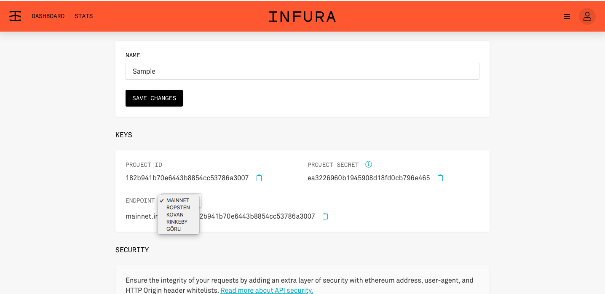
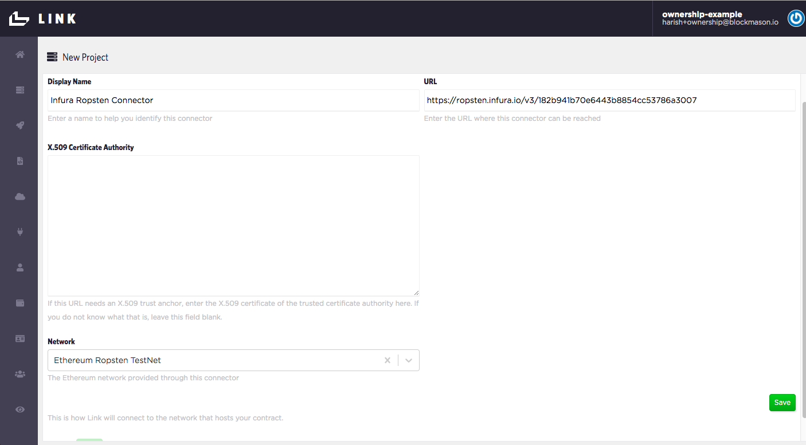
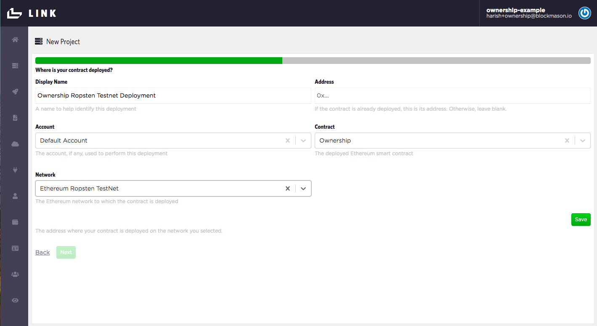
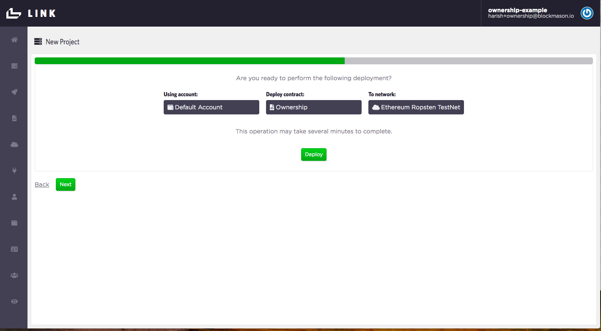
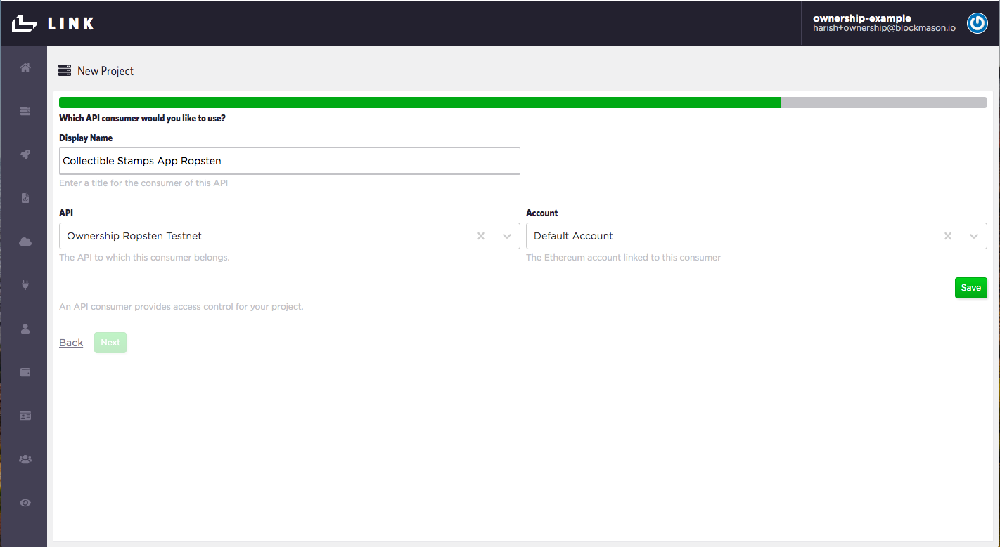
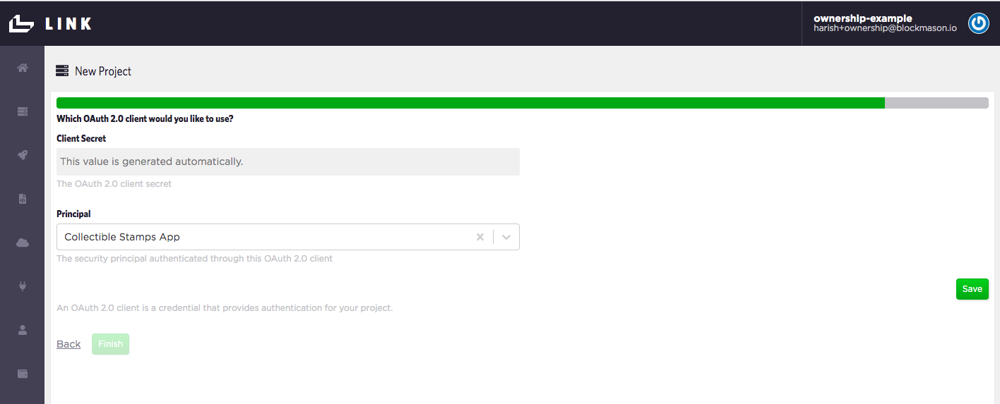

# link-onboarding
https://mason.link

Welcome to the onboarding material for Blockmason Link! We hope Link will be a useful developer tool to help you build your applications. Link is the first managed, decentralized, functions-as-a-service (FaaS) platform, pushing the envelope of interoperability by creating conventional web APIs for developers interacting with networks such as programmable blockchains.

### Signing Up

> Sign up for your Link account at https://mason.link/sign-up with your email address. You will then have to open your email and confirm your address.  

> After clicking on the confirmation link, create your account's passphrase and set your organization namespace. This is your Link organization.


You will then be on the Link Homepage consisting of an IDE with a `Demo` smart contract code. 


### Getting Started
Welcome to the Link Homepage! A few things to note here:

* The smart contract code that you see in the IDE is automatically deployed to the Link private blockchain in **near real-time**. When you make any changes to the code, a new deployment is automatically done.

* You can toggle between the code and the Link generated APIs screens:
. When you modify your code, your APIs will automatically update!

* At the bottom of the IDE/API window, you will see a `Client ID` and `Client Secret`. These are the credentials your front-end app will use to authenticate with Link to access the API endpoint.

* Currently, only the Solidity smart contract programming language is supported, which is most notably used on the Ethereum blockchain.

Since smart contracts deployed onto a blockchain are generally immutable (i.e. can NOT be changed), every time you make a change to the smart contract code in the Link IDE, effectively a new smart contract is being deployed which means a new `Client ID` and `Client Secret` will be generated for authentication.

> Try it! Here is a simple smart contract code (from `Ownership.sol`) for assigning ownership of an asset. **Delete** the `Demo` contract code and **copy and paste** the following code into the Link IDE and see what API endpoints are generated (note: it may take a few seconds for the change to persist):
```
pragma solidity ^0.5.8;

contract Ownership {
    mapping(string => address) public ownerOf;
    address public authority;
    
    constructor() public {
        authority = msg.sender;
    }
    
    function setOwner(string memory asset, address owner) public {
        ownerOf[asset] = owner;
    }
}
```
Your generated API endpoints should look something like the following. Also note the `Client ID` and `Client Secret` have changed!


So using the Link private blockchain, this is **all you need to do** to deploy your contract and generate your APIs. Simply copy/paste your smart contract code and the APIs will appear!

Now, *how do you actually use these API endpoints?*

### Link SDKs
https://blockmason.link/link-sdk/

To make it easy to use Link, we have developed several easy-to-use SDKs in a variety of popular programming languages so you can focus on building your apps using your preferred language. 

With all our SDKs, generally all you need is the `Client ID` and `Client Secret` for authentication.

The following link is to a simple example using the [JavaScript SDK](https://github.com/blockmason/link-sdk.js "Link JavaScript SDK") and our Ownership smart contract code from the previous section. Note this example uses the JavaScript SDK from a Node.js environment which requires the use of `node-fetch`: 

https://github.com/blockmason/link-onboarding/blob/master/ownership.js

First, `POST /setOwner` is called to set the owner of an asset and then `GET /getOwner` is called to retrive the owner address, with the request parameters and response object based on the Link API documentation. If I run the `ownership.js` script using Node from my Terminal, for example, I get:


Note: we do NOT need to use a complex library such as web3.js in our JavaScript file as Link abstracts away the blockchain interactions and complexity 'under-the-hood'. We are simply making an API call as we would with any 3rd party service.

### Using Ethereum or other public blockchains

Currently Link supports [Ethereum](https://www.ethereum.org/) and [GoChain](https://gochain.io/) public blockchains. 

The process for connecting and interacting with an external blockchain using Link is a bit more involved but relatively straightforward using the Link Project Wizard. In general, the process flow looks something like this (the deployment process for the Link private blockchain greyed out):


1. Create your smart contract in Link
2. Label your public blockchain
3. Setup your network connector by identifying the network RPC provider API endpoint. For Ethereum, we recommend using a hosted provider such as Infura. See [here](https://github.com/gochain-io/docs#network-rpc-urls) for GoChain. 
4. Deploy your smart contract onto the public blockchain
5. Label your generated APIs
6. Label your API Consumer (e.g. the name of your app using the APIs)
7. Obtain your OAuth API authentication (automatically generated)

Let's walk through the process for deploying and setting up our Ownership smart contract APIs on the Ethereum Ropsten Testnet. 

#### Using Ethereum Ropsten with Link

##### Setup

> First, setup an account on Infura, which provides easy-to-use APIs to interact with the Ethereum network without running your own Ethereum node. Register for an API key at https://infura.io/register and then create a project. You will then be able to access URLs containing your API key for the Ethereum Mainnet and all Testnets such as Ropsten which we will be using.



> Now seed your Link account wallet with test ETH from https://faucet.ropsten.be/ (1 ETH will be dripped to your wallet), which will be used to pay for transactions on the Ropsten testnet. You can find your Link account wallet address from the Ethereum Account menu as shown:

   


**Note: This Ropsten Faucet tracks the IP of the source making the request. On a common WiFi network, multiple requests from the same external IP will trigger the IP to be grey-listed for 24 hours. If so, connect your laptop to a different WiFi network or temporarily connect to a phone's WiFi hotspot when making the request**

##### API project setup in Link

> 1. In Link, open up the setting dropdown menu and select *`New Project`* which starts the new project wizard.


> 2. Under *Which contract would you like to use?*, select `Ownership` which we created in Part 1.

> 3. Under *Which Ethereum account would you like to use?*, use the *`Default Account`*. This is the account we seeded earlier with test ETH. 


> 4. Under *Which network would you like to use?*, select *`Create new`* and call it `Ethereum Ropsten Testnet`. Keep the *Block Confirmations Needed* at 0. Press *`Save`* and *`Next`*.

> 5. Under *Which connector would you like to use?*, select *`Create new`*. Call this connector `Infura Ropsten Connector` and use the URL for the Ropsten network from Infura (e.g. https://ropsten.infura.io/v3/182b941b70e6443b8854cc53786a3007). Ensure the *Network* selected is *`Ethereum Ropsten Testnet`*. Press *`Save`* and *`Next`*.



> 6. Now we just need to label our Deployment. Under *Where is your contract deployed?*, select *`Create new`*. Call this deployment `Ownership Ropsten Testnet Deployment`. Since we do not have **an existing contract deployment on Ethereum**, leave the *Address* field blank. Ensure the *Account* is the `Default Account`, the *Contract* is the `Ownership` contract and the *Network* `Ethereum Ropsten Testnet`. Press *`Save`* and *`Next`*.



> 7. Now we're ready to deploy our contract to the Ethereum Ropsten Testnet. Press `Deploy` and you should get a deployment in progress indicator icon. This might take a few seconds to complete. If deployed correctly, you'll proceed to the next step to setup your API.



> 8. Now we label our Ownership contract API. Under *Name*, call it *`ownership-ropsten-testnet`* Also add in a human-readable display name. Ensure you are using the correct *Contract Deployment*. Press *`Save`* and *`Next`*.

> 9. Now we label our Ownership API **Consumer**. This would normally be the name of the app or service calling the API. For example, let's call the consumer `Collectible Stamps App Ropsten`. Ensure you are using the correct *API* and *Account*. Press *`Save`* and *`Next`*.



> 10. Lastly, your consumer needs to authenticate with the Ownership API. A OAuth2.0 Client Secret is automatically generated. Ensure you are using the correct Principal/Consumer. Press *`Save`*, *`Next`* and then *`Finish`*.



Once you hit *`Finish`*, you should see your Ownership API documentation. Note the `client_id` and `client_secret` under *Authentication* which you will later use in your front-end app. 


Let's also check that our Ownership contract deployed correctly on the Ethereum Ropsten Testnet. Click on the `Ethereum Contract Deployments` menu item to see a list of contract deployments and their addresses. Copy and paste the address of the `Ownership Ropsten Testnet Deployment` into the Ropsten Testnet explorer https://ropsten.etherscan.io to see the details of your contract deployment.


In the above example, the contract address on Ropsten Testnet is `0x5d81167993cb26e25e60be9deb58aab0fe93eccc`.


And we see our contract deployed on the Ropsten Testnet!

Now you can go ahead and use the API endpoints which are linked to the Ownership smart contract deployed on Ethereum Ropsten!

**Note:** If you want to deploy on the Ethereum Mainnet, just follow the same steps. The only difference is that you will need to:
* > Acquire actual ETH to send to your Link wallet
* > Use the Infura Mainnet URL

##### Deploying to GoChain
The process for deploying to GoChain (the Testnet or Mainnet) is also very similar. Just follow the same steps as above with only the following differences:

* > Ask for some free testnet GO in GoChain's [Testnet Telegram](https://t.me/gochain_testnet) to be sent to your Link account
* > For your Link Network Connector, use the appropriate [GoChain Network RPC URL](https://github.com/gochain-io/docs#network-rpc-urls)

Now you can run a front-end app using multiple blockchains with Link by simply using the appropriate set of API credentials that you setup in your front-end app! Link, with its inter-operability feature, opens up the ability for developers to **pick and choose what information to record on what blockchain**, depending on the desired benefits, versus having to pick and chose a specific blockchain and tech stack!