## Using ThunderCore with Blockmason Link
ThunderCore is an Ethereum compatible, Smart Contract platform boasting 1,200+ transactions-per-second (TPS), quick block confirmations and low gas costs, making it quick and easy for DApps to deploy and scale.

In this onboarding example, we will deploy a smart contract to the ThunderCore Testnet. 

### Setup
> You can obtain some testnet TT tokens from [ThunderCore Testnet Faucet](https://faucet-testnet.thundercore.com) to be sent to your Link default account address (note you need to sign-in with Google or Github):

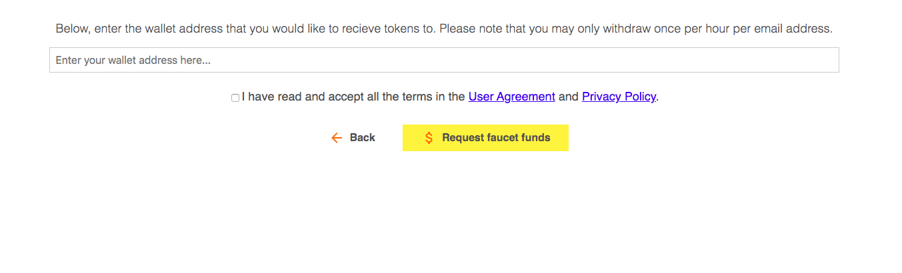

* Note: ThunderCore also offers a small amount of **free Mainnet TT tokens** to build applications there. See https://developers.thundercore.com/docs/get-tokens/

### API project setup in Link
> 1. In Link, either press the `+ Create new` button above the code editor or open up the setting dropdown menu and select *`New Project`* - both which starts the new project wizard.

> 2. Under *Which contract would you like to use?*, select `Ownership` if the contract already exists, or select *`Create new`* and then copy and paste the `Ownership.sol` code into the *Source Code* field. Set the *Display Name* as `Ownership`. Press *`Save`* and *`Next`*.

.

> 3. Under *Which Ethereum account would you like to use?*, use the *`Default Account`*. This is the account we seeded with test TT tokens as part of the setup. 

> 4. Under *Which network would you like to use?*, select *`Create new`* and call it `ThunderCore Testnet`. Keep the *Block Confirmations Needed* at 0. 

> At the time writing this guide, ThunderCore uses the **byzantium** EVM Version. Please check https://developers.thundercore.com/docs/migrate-to-thunder/ for the latest version information. 

Press *`Save`* and *`Next`*.

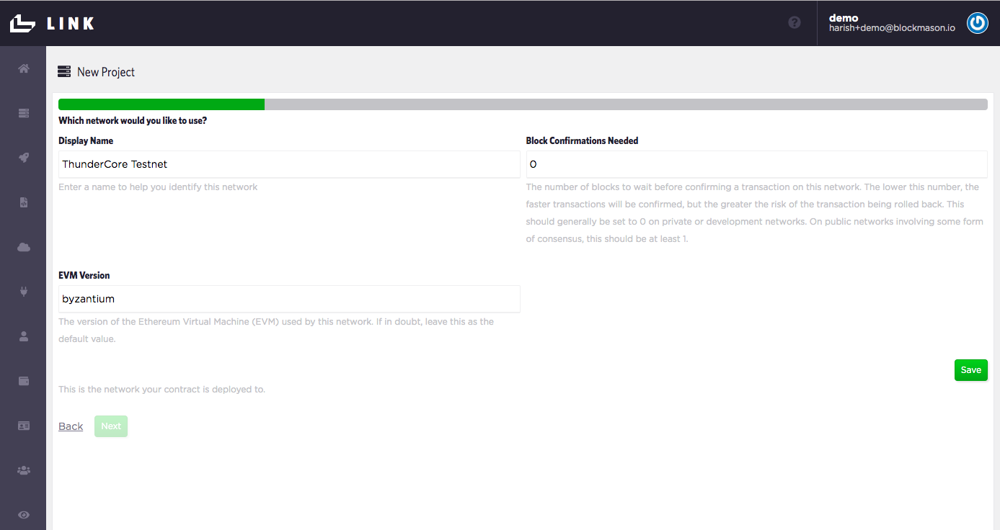

> 5. Under *Which connector would you like to use?*, select *`Create new`*. Call this connector `ThunderCore Testnet Connector` and use the URL `https://testnet-rpc.thundercore.com` (see https://developers.thundercore.com/docs/migrate-to-thunder/ for more details). Ensure the *Network* selected is *`ThunderCore Testnet`*. Press *`Save`* and *`Next`*.

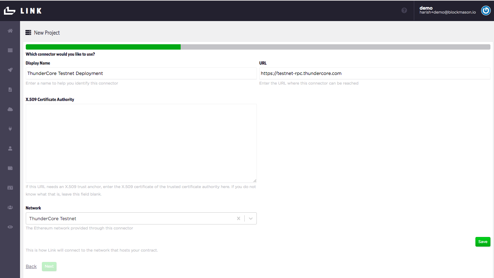

> 6. Now we just need to label our Deployment. Under *Where is your contract deployed?*, select *`Create new`*. Call this deployment `Ownership ThunderCore Testnet Deployment`. Since we do not have **an existing contract deployment**, leave the *Address* field blank. Ensure the *Account* is the `Default Account`, the *Contract* is the `Ownership` contract and the *Network* `ThunderCore Testnet`. Press *`Save`* and *`Next`*.

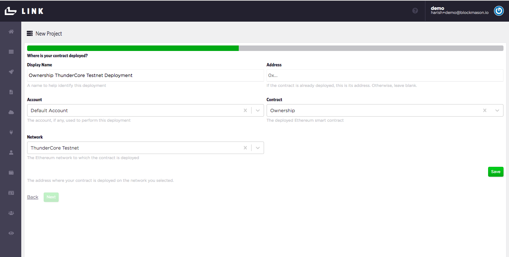

> 7. Now we're ready to deploy our contract to the ThunderCore Testnet. Press `Deploy` and you should get a deployment in progress indicator icon. This might take up to a minute to complete. If deployed correctly, you'll proceed to the next step to set up your API.

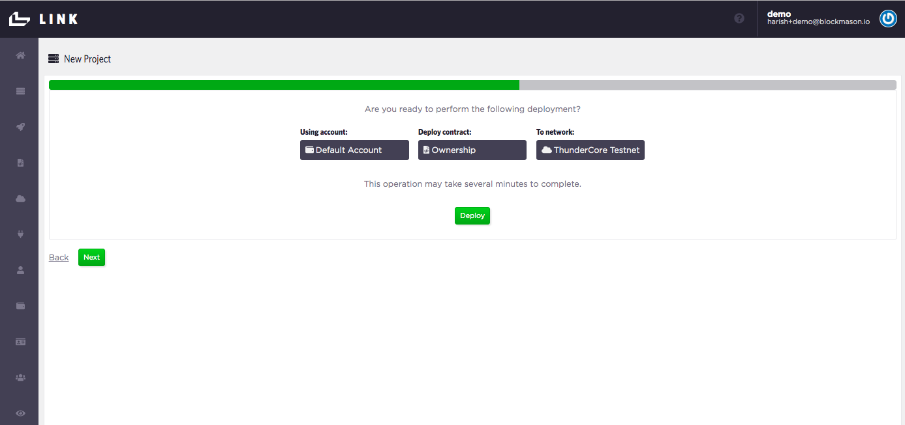

> 8. Now we label our Ownership contract API. Under *Name*, call it *`ownership-thundercore-testnet`* Also add in a human-readable display name. Ensure you are using the correct *Contract Deployment*. Press *`Save`* and *`Next`*.

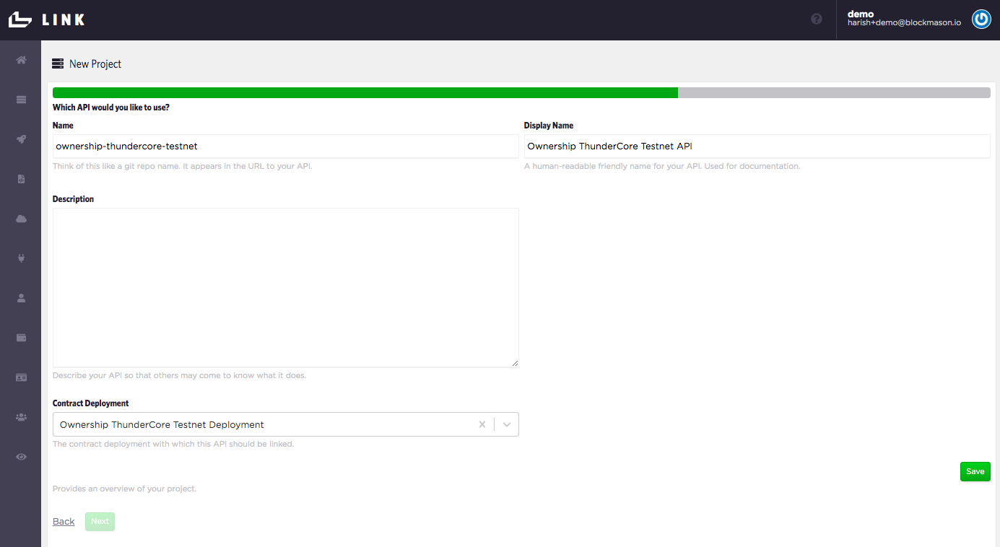

> 9. Now we label our Ownership API **Consumer**. This would normally be the name of the app or service calling the API. For example, let's call the consumer `Collectible Stamps App`. Ensure you are using the correct *API* and *Account*. Press *`Save`* and *`Next`*.

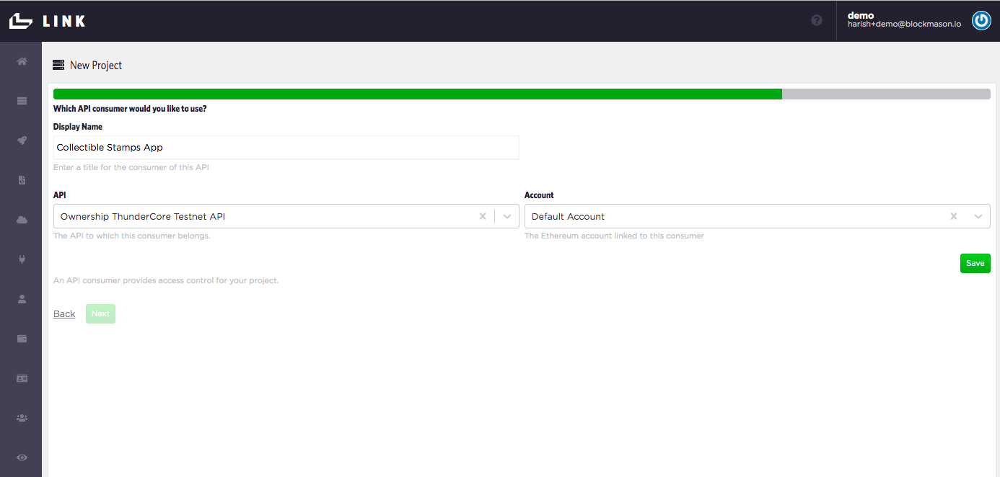

> 10. Lastly, your consumer needs to authenticate with the Ownership API. An OAuth2.0 Client Secret is automatically generated. Ensure you are using the correct Principal/Consumer. Press *`Save`*, *`Next`* and then *`Finish`*.

Once you hit *`Finish`*, you should end up back at Home page and see your Ownership code in the IDE, the API tab and a gear icon containing the `client_id` and `client_secret` at the bottom of the page which you will use in your app. 

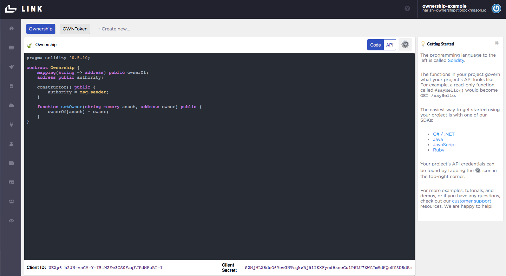

Let's also check that our Ownership contract deployed correctly on the ThunderCore Testnet. Click on the `Ethereum Contract Deployments` menu item to see a list of contract deployments and their addresses. Copy and paste the address of the `Ownership ThunderCore Testnet Deployment` into the ThunderCore Testnet explorer https://scan-testnet.thundercore.com/ to see the details of your contract deployment.

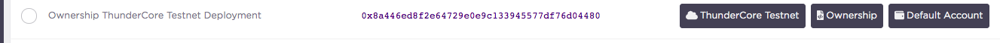

In the above example, the contract address on the ThunderCore network is `0x8a446ed8f2e64729e0e9c133945577df76d04480`.

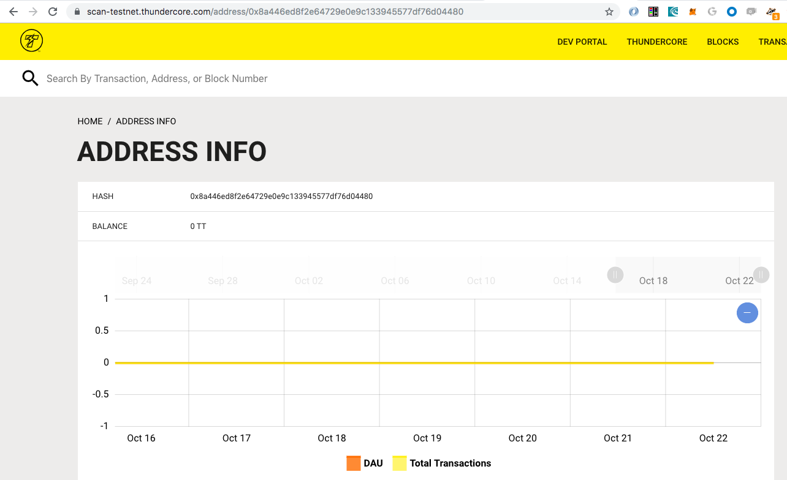

And we see our contract deployed on ThunderCore!

Now you can go ahead and use the Link API endpoints which are linked to the Ownership smart contract deployed on ThunderCore Testnet!

### Test Ownership API endpoints
A simple JavaScript file using the Link JavaScript SDK in a Node environment can be found here:

https://github.com/blockmason/link-onboarding/blob/master/ownership-link-sdk-demo.js

> First, run `npm install` from your Terminal to install the `node-fetch` and `@blockmason/link-sdk` dependencies (see `package.json`).

> Then, in `ownership-link-sdk-demo.js`, update the `clientID` and `clientSecret` for authentication.

 > Finally run the `ownership-link-sdk-demo.js` script using Node from the Terminal. You should see an output in Terminal similar to the following:

 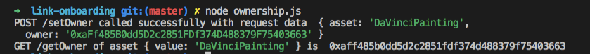

 > Check your Ownership contract using the ThunderCore Testnet Explorer to confirm the new transactions representing the `setOwner()` and `getOwner()` function calls. 

### Deploying to ThunderCore Mainnet

If you want to deploy on the ThunderCore Mainnet, just follow the same steps above with the following differences:
  > 1. Acquire Mainnet TT tokens to send to your Link default account wallet
  
  > 2. Use the use the appropriate [ThunderCore Mainnet RPC endpoint](https://developers.thundercore.com/docs/migrate-to-thunder/).